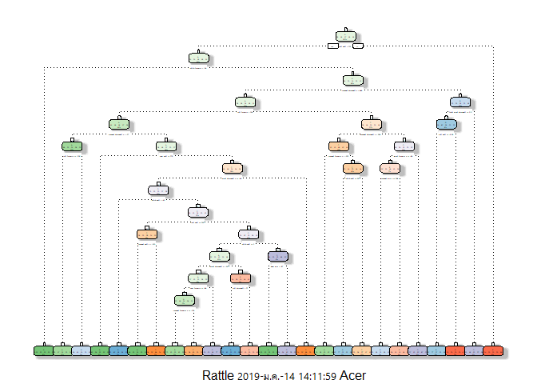

#Synopsis
The purpose of this project is to predict the manner of 6 participants in which they did weight lifting exersice, based on data of accelerometers on the belt, forearm, arm, and dumbell of them.


#Data Cleaning and Processing

After importing necessary libraries of this project, the data was imported from "pml-training.csv" and "pml-testing.csv" file. 


```r
#import libraries
library(dplyr)
library(ggplot2)
library(data.table)
library(lubridate)
library(caret)
library(rattle)
library(rpart)

#set working directory
setwd("D:/Google Drive/dataScientist/")

#import data
weightLiftingTrain<-read.csv("pml-training.csv")
weightLiftingTest<-read.csv("pml-testing.csv")
```


Blank cell was then transformed into NA value. Then, only data that is numeric was selected. 


```r
#set all blank cell to NA
weightLiftingTrain[weightLiftingTrain==""]<-NA

#select only numeric columns 
trainNumOnly<-weightLiftingTrain[,-(1:7)]

use<-integer()
for (i in seq(1,ncol(trainNumOnly)-1)){
  trainNumOnly[[i]]<-as.numeric(trainNumOnly[[i]])
  if (mean(is.na(trainNumOnly[[i]]))<0.05){
    use<-c(use,i)
  }

}
trainNumOnly<-trainNumOnly[,c(use,ncol(trainNumOnly))]  
```

#Decision Tree

Decision tree was chosen as the first machine learning model, since this problem is non-linear, and decision tree is easy to interpret the result.
Data was split into two group and use only the first group for training.

<!-- -->

The accuray of decision tree model was calculated comparing to second data group, which was 75.7%.


```
## Confusion Matrix and Statistics
## 
##           Reference
## Prediction    A    B    C    D    E
##          A 2041   71   60   24   36
##          B  229  946  145  114   84
##          C   23  123 1105   82   35
##          D   73  113  197  813   90
##          E   23  132  174   83 1030
## 
## Overall Statistics
##                                           
##                Accuracy : 0.7564          
##                  95% CI : (0.7468, 0.7659)
##     No Information Rate : 0.3045          
##     P-Value [Acc > NIR] : < 2.2e-16       
##                                           
##                   Kappa : 0.6912          
##  Mcnemar's Test P-Value : < 2.2e-16       
## 
## Statistics by Class:
## 
##                      Class: A Class: B Class: C Class: D Class: E
## Sensitivity            0.8543   0.6830   0.6573   0.7285   0.8078
## Specificity            0.9650   0.9115   0.9573   0.9297   0.9373
## Pos Pred Value         0.9144   0.6232   0.8077   0.6322   0.7143
## Neg Pred Value         0.9380   0.9306   0.9111   0.9538   0.9617
## Prevalence             0.3045   0.1765   0.2142   0.1422   0.1625
## Detection Rate         0.2601   0.1206   0.1408   0.1036   0.1313
## Detection Prevalence   0.2845   0.1935   0.1744   0.1639   0.1838
## Balanced Accuracy      0.9097   0.7973   0.8073   0.8291   0.8726
```

The variance importance was also determined.


```
##            roll_belt           pitch_belt         accel_belt_z 
##          1561.701507           920.733529           818.861152 
##        pitch_forearm    magnet_dumbbell_y     accel_dumbbell_y 
##           760.995515           664.804570           611.908908 
## total_accel_dumbbell     total_accel_belt         roll_forearm 
##           570.822595           530.395866           512.179753 
##             yaw_belt    magnet_dumbbell_z      accel_forearm_x 
##           502.220859           458.987662           457.845728 
##        magnet_belt_z        roll_dumbbell        magnet_belt_x 
##           455.305642           381.757182           361.406926 
##         accel_belt_x         accel_belt_y     magnet_forearm_z 
##           325.081770           316.886333           291.376113 
##      accel_forearm_z     accel_dumbbell_x     magnet_forearm_y 
##           275.187234           262.155060           241.758860 
##          yaw_forearm     accel_dumbbell_z        magnet_belt_y 
##           233.982575           225.464276           220.538237 
##              yaw_arm      accel_forearm_y     magnet_forearm_x 
##           207.801876           171.565249           117.821021 
##         gyros_belt_z         yaw_dumbbell         magnet_arm_y 
##           112.774821           112.096456            80.211871 
##            pitch_arm          accel_arm_x         magnet_arm_x 
##            66.634086            65.449862            64.066902 
##     gyros_dumbbell_x         magnet_arm_z          accel_arm_y 
##            63.080406            57.773257            52.694457 
##          gyros_arm_x          gyros_arm_y         gyros_belt_y 
##            49.152989            37.809992            36.550251 
##      total_accel_arm             roll_arm     gyros_dumbbell_y 
##            29.864774            19.297939            14.777242 
##       pitch_dumbbell         gyros_belt_x      gyros_forearm_x 
##            13.713327            11.925280             5.218779 
##          accel_arm_z 
##             4.233398
```

#Random Forests

The accuracy of decision tree model (75.7%) was not enough to be used for prediction. Therefore, random forests model was selected for accuracy improvement. Since this model is computationally expensive, only 4 predictors (roll_belt, pitch_belt, accel_belt_z, pitch_forearm) were chosen from the variance importance of decision tree model.


```
##    user  system elapsed 
##  439.72   31.33  487.94
```

```
## Confusion Matrix and Statistics
## 
##           Reference
## Prediction    A    B    C    D    E
##          A 1995   76   83   59   19
##          B   65 1249  116   67   21
##          C   34   88 1158   74   14
##          D   27   39   57 1151   12
##          E   16   23   14   24 1365
## 
## Overall Statistics
##                                           
##                Accuracy : 0.8817          
##                  95% CI : (0.8744, 0.8888)
##     No Information Rate : 0.2724          
##     P-Value [Acc > NIR] : < 2.2e-16       
##                                           
##                   Kappa : 0.8507          
##  Mcnemar's Test P-Value : 1.688e-07       
## 
## Statistics by Class:
## 
##                      Class: A Class: B Class: C Class: D Class: E
## Sensitivity            0.9336   0.8468   0.8109   0.8371   0.9539
## Specificity            0.9585   0.9578   0.9673   0.9791   0.9880
## Pos Pred Value         0.8938   0.8228   0.8465   0.8950   0.9466
## Neg Pred Value         0.9747   0.9643   0.9583   0.9659   0.9897
## Prevalence             0.2724   0.1880   0.1820   0.1752   0.1824
## Detection Rate         0.2543   0.1592   0.1476   0.1467   0.1740
## Detection Prevalence   0.2845   0.1935   0.1744   0.1639   0.1838
## Balanced Accuracy      0.9460   0.9023   0.8891   0.9081   0.9709
```
It can be seen that random forest model was able to achieve 88.2% accuracy, with p-value to be significant.

#Predict Test Case
Finally, the random forest machine learning model was used to predict 20 different test cases.


```
##  [1] B C B D A E D D A A B C B A E C A B B B
## Levels: A B C D E
```


